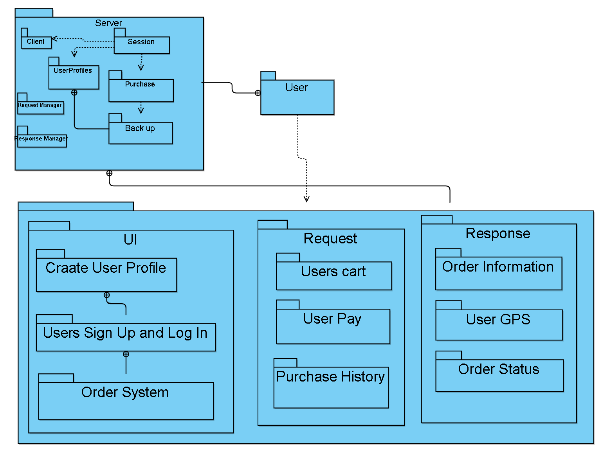
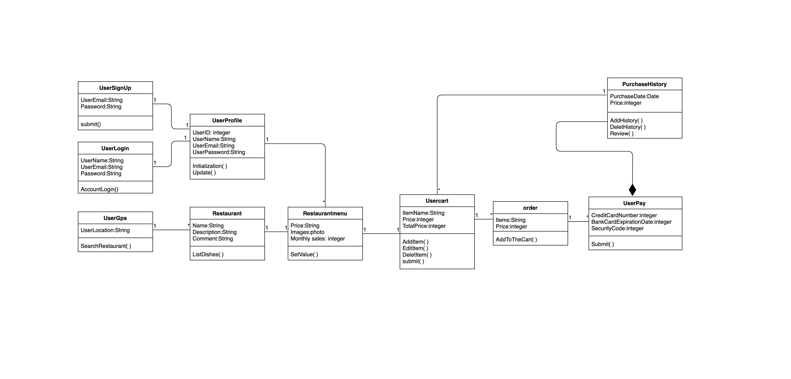
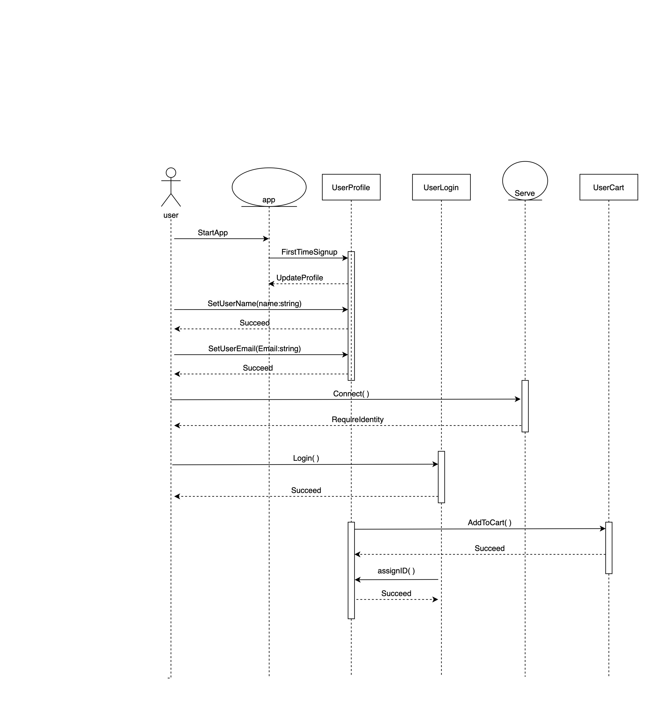

# Design ( *Deliverable-05* )

## 1. Description.
For students and staff, takeaway has always been a good way to solve a meal. Whether for locals or people from other countries, ‘E-kitchen’ can provide them with a good takeaway service. ‘E-kitchen’ supports the choice of different languages. After selecting the language, the user will register/log in and get information about nearby restaurants. The user can select a restaurant to view the menu and add the selected food to the cart. After the selection is completed, the user can check out the cart. Users can view historical records and select previous purchases to re-order. After the re-order, the food will be added to the cart, and the user can check out to complete the purchase. Unlike other software, ‘E-kitchen’ will have more detailed meal information and evaluation system, and users can easily view the order history.

## 2. Architecture.
  ## Architecture Diagram
  
  The Server and Android App are the two main modules of our project. They have been split into two different packages They have been split into two different packages. The dotted arrows represent that users have access to both classes. Also, when a package is inside another package it represents they belong to the same larger class. Each class was made into a package and their relationships with each other is shown through the UML package diagram. Additionally, on a larger scale the diagram shows the relationship between the User, Android App, and the Server.
  
## 3. Class Diagram 
  ## UML
  

## 4. Sequence Diagram
   
  Use-Case: Report past order
Actor: User
Description: Report problems to customer service
Pre-Conditions: The order is entered in The database.
Post Conditions: Send the report to the customer service client.
Flow:
The user enters the purchase history
The user selects the order to report
The user enters the report content
User confirmed report
The system sends the report to customer service
Alternative Flows:
User exits without reporting
System Prompt whether confirmation
User confirms
System returns to order history
User cancels
System returns to order history

## 5. Design Patterns 
Design Pattern 1: (Creational) Singleton - (link) only one static function submit()
of the Server class is allowed because of the private variable UserEmail and Password

 
Figure 5.1 - UML diagram of implementation of the UserSignUp method

Design Pattern 2: (Structural) Flyweight - (link) method to retrieve the
only order object created by the application.
 
Figure 5.2 - UML Diagram of the implementation of the Flyweight pattern in
the Usercart class

Design Pattern 3: (Behavioral) Template Method - (link) overrides the
SearchRestaurant() method in the Restaurant interface
  
Figure 5.3 - UML diagram of the implementation of the template pattern in
the class of find restaurant

## 6. Design Principals
Single Responsibility Principle: link - UserSignUp class just implements the function of providing user registration.

Open/Closed Principle: link - The code follows this principle because each time a new restaurant is added,the server will change the information automatically. It is also closed because no modifications need to occur.The code not need to modify because it was designed to have the ability to add a new restaurant.

