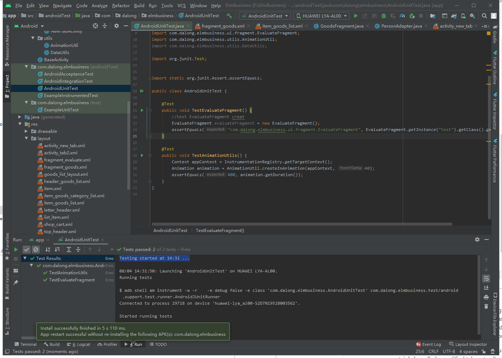
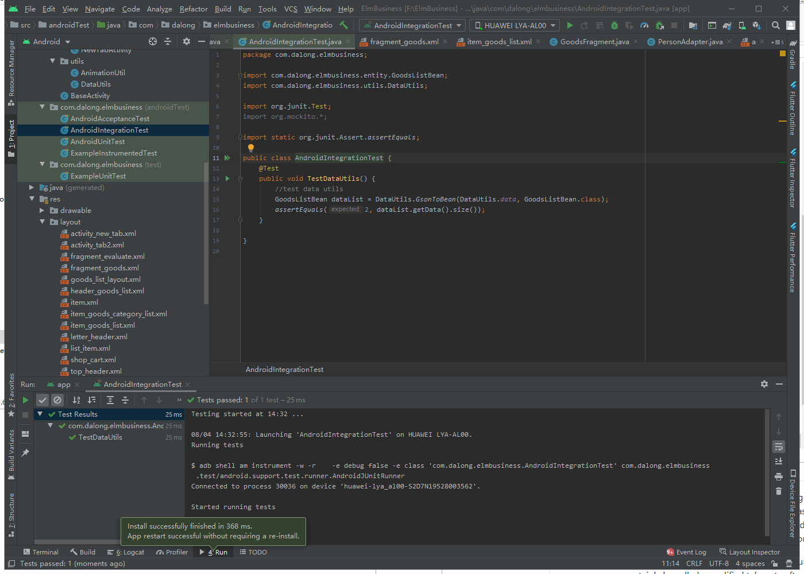
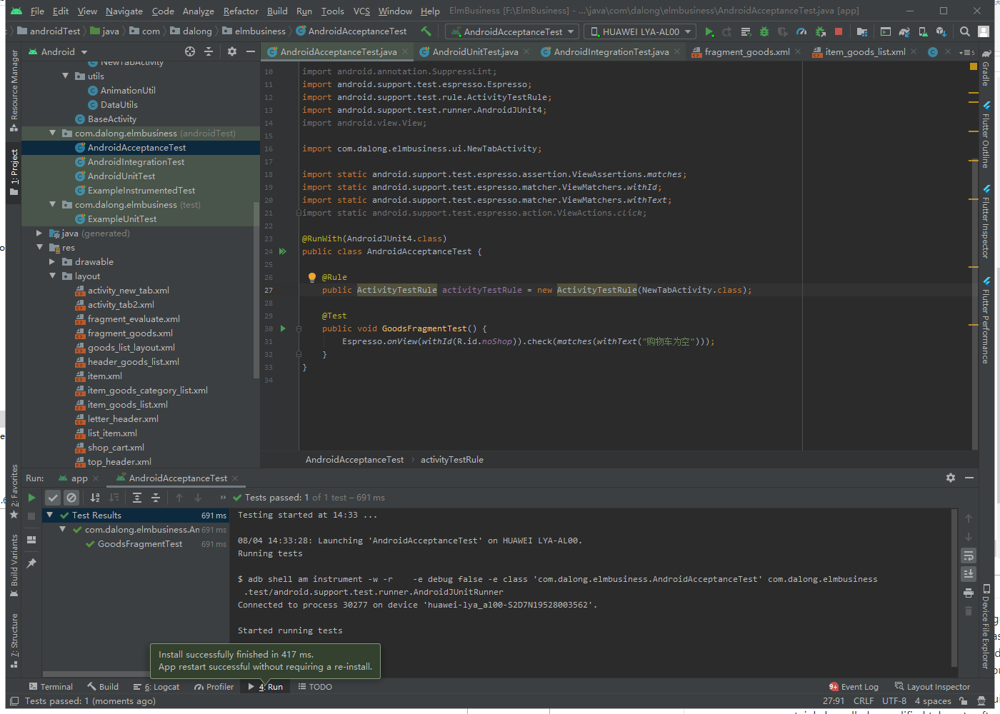

# Verification & Validation(Deliverable #7)

## Description
Our application will offer service for students and workers on Android Platform(not available on PC). The app is aimed at making people's life easier when it comes to eat.
But the problem we have is that we don't know how to make people find restaurants next to them. It is the most biggest barrier we have met so far because it is convenient
for them to order food fast and this action will increase our user usage. "E-kitchen" shoule be a popular app that can provide detailed information and fast take-out services to make our users have their meals as soon as posible. Unlike doordash which is famous in US, we provide users with detailed information about the food ingredients, cook time and cook progress. These features will let our users know their status of order clearly. Our application requires our users to use a user-name and password to log in. So users can store their address, personal information, order history and paymemt method after logging in. Certainly, users can pay the bill by using guest payment if they don't want to create an account. But if users want to review the order history, they need to create an account to log in the system. Another bright spot of our app is that users can get the refund for the first time in a restaurant if they are not satisfied with the food. But if users order the foof at the same restaurant over two times, they can't get the refund.

## Verification(test)
### Unit test
Test Framework: JUnit  
Link to file:[Unit Test File](./test/AndroidUnitTest.java)  
Example:
```bash
	@Test
    public void TestAnimationUtils() {
        Context appContext = InstrumentationRegistry.getTargetContext();
        Animation animation = AnimationUtil.createInAnimation(appContext, 40);
        assertEquals(400, animation.getDuration());
    }
```
Print screen:

### Intergration test
Test Framework: Mockito  
Link to file:[Intergration Test File](./test/AndroidIntegrationTest.java)  
Example:
```bash
    @Test
    public void TestDataUtils() {
        //test data utils
        GoodsListBean dataList = DataUtils.GsonToBean(DataUtils.data, GoodsListBean.class);
        assertEquals(2, dataList.getData().size());
    }
```
Print screen:

### Acceptance
Test Framework: Espresso  
Link to file:[Intergration Test File](./test/AndroidAcceptanceTest.java)  
```bash
    @Test
    public void GoodsFragmentTest() {
        Espresso.onView(withId(R.id.noShop)).check(matches(withText("购物车为空")));
    }
```
Print screen:

## Validation(user evaluation)
* Rate our control fluency and interface design and explain why (Scale of 1 to 10,)
Kobach: 7 points, because this software screen transition is too rigid but not so uncomfortable, it at least makes me clear what I need to find, including restaurants, introductions and dishes.
Gohmert: 6.5 points. Because the interface design is too square, the screen transition is not smooth, showing the simplicity of the software. Sometimes you can't get feedback when you click the button, which may be because the interface design is not reasonable enough.

* Does this take-out software meet your requirements for selling software functions? If not, list the functions you want to add
Kobach: It can certainly be called a qualified takeout software, because it has the basic functions that takeout software should have, including viewing dishes, ordering food, and it has multiple language functions, and If possible I hope it can also add supermarket takeout services, not just restaurants
Gohmert: As a takeaway software, it meets the basic requirements of takeaway software, but it doesn't do enough in many details. For example, I cannot see the expected delivery time. Sometimes I only have half an hour break between two classes. I want to finish the meal within half an hour. If I can't see the expected delivery time, I can't eat within the time I want, which will reduce my use of this software.

* As a student user, what do you think is the advantage of this software?
Kobach: Students' control of information technology in the new era is much higher than that of people from other eras. Therefore, as for mobile phone software, they are the main force now. In that case, we should select such a large base group as the sales target, so that the service provided to students will be more perfect and perfect.
Gohmert: Because this software is also developed by students, it can better understand the needs of students, and students need to order take-out food most of the time due to their living habits or pressure from study and work, so I think students are the main consumers.

* Summary:

Interface: Our software interface is relatively simple and has no characteristics. The recognition of the software is not high. We also don't have a software logo, which is easy to be forgotten when compared with products of the same type.

Fluency: Because our software is now in the stage of just being developed, its size is relatively small. The operation of each function is very smooth, there is no sense of lag. The users who participated in the test were also satisfied with the fluency, which is the advantage of our product. In terms of fluency, we need to maintain.

Expected user satisfaction: The predicted users of our products are students. When developing, we assumed NAU students as the user group. When I tested the NAU students, they were all satisfied. So I think our software can initially expand from software localization. For student users